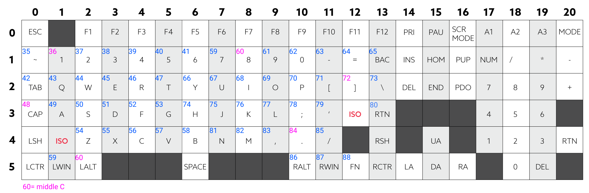

This project is GUI application to makes wooting midi keyboard.

features
- corresponds to velocity
- can press 16 keys simultaneously

os
- windows

wooting is the analog mechanical keyboard
https://www.wooting.nl/


### Setup application

put your wooting-analog-sdk.dll in woot_midi_mania/woot_music_keyboard/

```
$pipenv install
```

### Run Application
```
$ pipenv shell
$ python main.py
#(woot_midi_mania/src/main.py)
```

### Usage


Just chose the port and the channel you want to use.  
If you don't find any port or need a virtual midi port, I recommend to use [loopmidi](https://www.tobias-erichsen.de/software/loopmidi.html)  
Let's enjoy !

### Default MIDI map


### TODOS
- octave shift  
- receive MIDI and illuminate the keys
- key map configure
- scale mode
